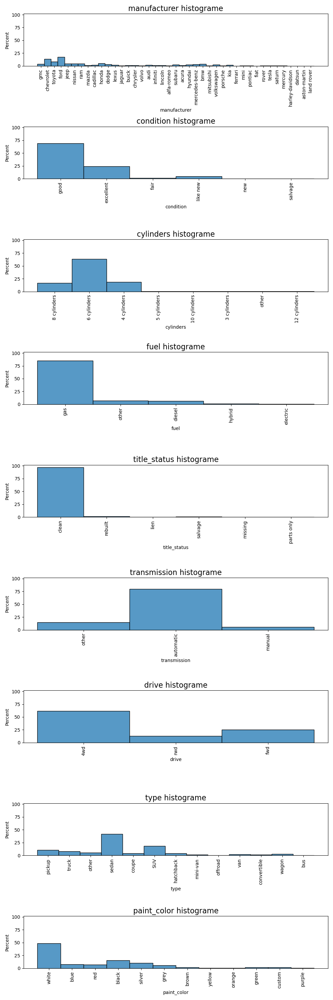
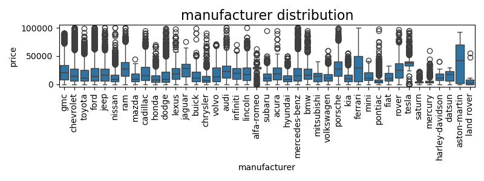
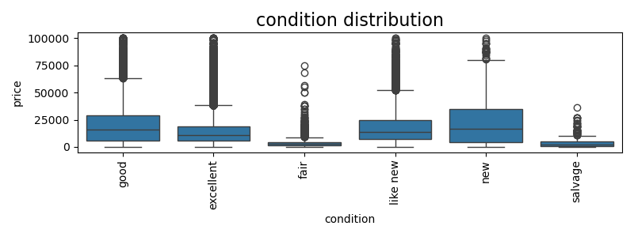
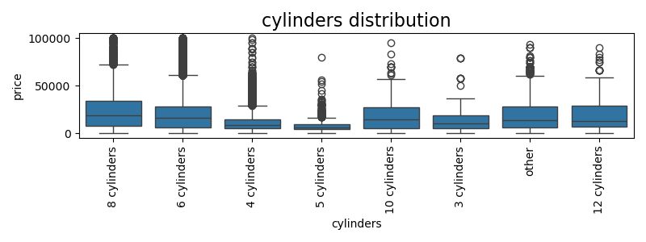
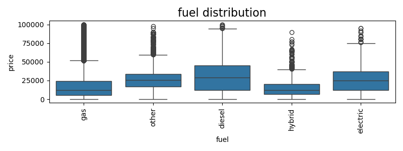
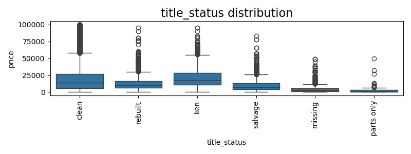
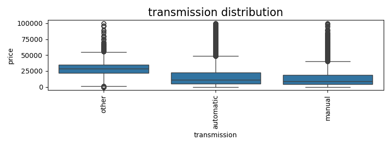
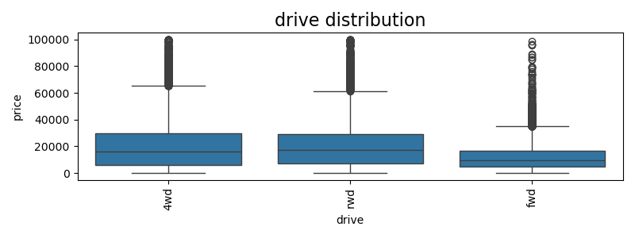
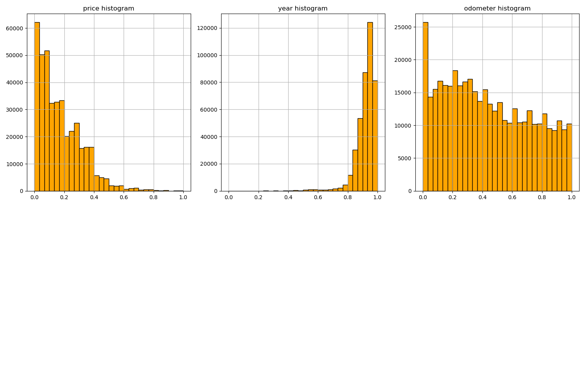

# Used Car Price EDA and Prediction Model
----------

In this project, we will perform the Exploratory Data Analysis(EDA) to understand *what factors drives the used car price* and build predictive model to understand the weight of each variable. 

Finally we will provide the summary of our EDA findings and provide recommendations to Used Car Dealer business client team regarding what consumers value in a used car

**Note :** This is a UC Berkeley Haas AI/ML Certification Course Assignment

## Approach
----------

In order to achieve objective, I will follow below **CRISP-DM** framework steps

1. **Business Understanding ** 
2. **Data Understanding ** 
3. **Data Preparation ** 
4. **Exploratory Data Analysis(EDA) ** 
5. **Modeling **
6. **Evaluation **
7. **Results **
8. **Conclusion **

## Business Problem Statement
--------

Used cars market is a large market and the car prices are often depends on multiple factors.

Goal is to understand what factors make a car more or less expensive. As a result of this analysis, we should provide clear recommendations to your client(a used car dealership) as to what consumers value in a used car?

## Objective
--------
Objectives of these projects are
- Peform thorough Exploratory Data Analysis(EDA) and summarize the business insights to `used car dealership business team`
- Apply multiple predictive ML models and choose the best performing predictive model
- Provide recommendations to client regarding what features consumers values most

## Data Set
--------
The original dataset contained information on *3 million* used cars. The provided dataset contains information on *426K* cars to ensure the speed of processing

- Number of input samples : 426,880
- Number of features : 17
- Target or dependent variable : price

Original Dataset : [Kaggle Used Car Dataset](https://www.kaggle.com/datasets/austinreese/craigslist-carstrucks-data)

## Exploratory Data Analysis(EDA)
--------

### Price Distribution

**Note :** From the above price distribution chart
- Most of the car prices are < 20K and distribution is right skewed
- p50(median) is 14K
- Above 60K are outliers

### Categorical Feature Data Exploration
#### Categorical Feature Type Distribution Summary

*Observations:* From the above feature hist distributions

- Used cars market is dominated by Ford(20%), Chevrolet(15%), toyota(10%), honda(5%), gmc(3%) and bmw(2%) etc.,
- Condition of cars
    - 70% of the used cars are in good condition
    - 25% of them are in excellent condition
    - 5% of them almso new
- Cylinder type
    - 65% of them are cylinders
    - each of the 4 and 8 cyliders remaining % equally (which is almost 15% each)
- Fuel Type
    - 85% of them are gas
    - 5% of them diesel and remaining others like electric/hybrid (As electric is very less, so this shows the dataset is very old...)
- Title status
    - 95% of them have clean titles
- Transmission type
    - Almsot 80% of them are automatic
- Drive type
    - 60% of them are four wheel drive
    - 25% of them are fwd drive
- Type distribution
    - 40% of them are Sedan
    - 18% of them are SUV
- Color distribution (color might not contribute price value but it is definitely one of the purchase decision factor)
    - 50% of the white
    - 15% of them black

#### Price distribution per caterorical type

Categorical type features impact on price Observations
- prices by brands
    - `aston-martin` brand has highest price
    - just to note, used `electric` vehicles like `tesla` has high price
    - `land-rover` has least used car price
- prices by condition
    - `good` and `new` condition has high prices
    - `fair` and `salvage` conditioned used vehicles has least prices
- prices by cyliders
    - Seems highly demanded types like `8/6` cylider types has more price than `10/12` cylinders
- prices by fuel types
    - `diesel` and `electic` fuel types has higher prices than `gas` fuel type
- prices by title status
    - `clean` and `lien` status used cars has more price
    - `missing/salvage` and `parts only` statuses has less price
- prices by transmission type
    - `other` transmission type has higher price, but unfortunately we don't have further details on other types, most likely it might be electric cars
    - `automatic` pricier than `manual`
- prices by type
    - `pickup/truck/coupe` types has higher prices
    - `mini-vans` has lowest price
- prices by car paint color
    - seems paint color is not determining the car price. So better to drop this feature

### Numerical features distributions

**Observations**

- Odometer is evenly distributed, just to note there are good number with < 5K odometer value
- most of the cars from 2015-2020 make year
- As we observed most of the used car prices are < 40K

## Results
--------
Across Liniear Regression/Decision Tree/Gradient Boosting/Random Forest models, Radom Forest beats remaining all the models

For mode details on modeling results, please refer [prediction_model_notebook](./notebooks/Used_car_price_EDA_and_prediction_model.ipynb)

## Conclusion
--------
Below are the features, consumer values most
- Car's model year : Values latest year
- Odometer : The lesser odometer, pays more
- Car manufacturer : Type of manufacturer matters
- Car condition : new condition is valued more
- car title : Values clear title

Also as provided in results section of [prediction_model_notebook](./notebooks/Used_car_price_EDA_and_prediction_model.ipynb)  used car price can be calculated using predictive model
